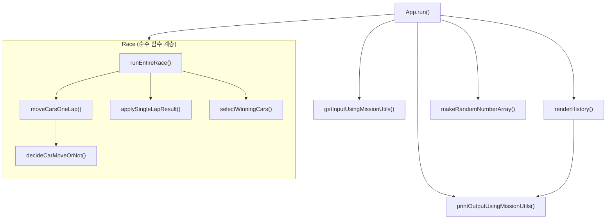

# javascript-racingcar-precourse
# 학습 목표
- 여러 역할을 하는 큰 함수를 단일 역할을 하는 작은 함수로 분리한다.
- 테스트 도구를 사용하는 방법을 배우고 프로그램이 제대로 작동하는 지 테스트 한다.
- 1주차 피드백을 반영한다.
# 요구사항 정리
### 1주차 피드백 정리
- git 명령어, git 자원, 관리 파일(package.json, package-lock.json 등) 역할 학습
- 디버거 사용에 익숙해지기
- 좋은 이름 짓기
- 정확한 공백 사용
- 의미 없는 주석 달지 않기
- JavaScript API 적극 활용
### 기능 요구사항
자동차 경주 게임을 구현
- 사용자는 자동차의 이름과 몇 번 이동할 것 인지 입력할 수 있다.
  - 이름에 대한 입력은 쉼표를 기준으로 구분하며, 각 자동차 명은 5자 이하
- 주어진 횟수 동안 전진/정지 할 수 있다.
  - 0~9 무작위 값이 4 이상일 경우 전진 / 4 미만 정지
- 자동차 경주 게임이 종료된 후 누가 우승했는지를 알려준다.
  - 우승자가 여러 명일 경우 쉼표(,)를 이용하여 구분
- 사용자가 잘못된 값을 입력할 경우 "[ERROR]"로 시작하는 메시지와 함께 Error를 발생시킨 후 애플리케이션은 종료된다.
### 프로그래밍 요구사항
- 함수가 한가지 일만 하도록 작게 만들기 
  - 들어쓰기 깊이 2까지만 허용
- 3항 연산자 사용 X
- Jest로 테스트 코드 작성하여 기능 정상 작동 확인
  - Jest 활용법 공부하기

# 설계
## 함수 구조

## 기능 목록
- [x] 입력 
  - [x] 자동차 명 입력 받기
  - [x] `,` 기준으로 자동차명을 구분
  - [x] 진행 랩 수(몇번 진행할 것인지) 입력 받기
- [ ] 입력값 검증(예외)
  - [ ] 사용자가 잘못된 값을 입력할 경우 `[ERROR]`로 시작하는 문구와 함께 에러를 발생시키고 프로그램을 종료시킨다.
  - [x] 각 자동차명은 공백을 포함하지 않은 5자 이하의 문자열이다.
  - [x] 각 자동차명은 중복을 허용하지 않는다.
  - [ ] 랩 수는 양의 정수이다.
- [x] 랜덤 넘버 데이터 생성
  - [x] `자동차 수 * 랩 수` 만큼의 랜덤 숫자(0~9사이 정수) 생성
- [x] 레이스 진행(전진 or 정지)
  - [x] 랜덤 숫자가 4 이상(4,5,6,7,8,9)이면 전진, 4미만(0,1,2,3)이면 정지
- [x] 우승자 결정
  - [x] 가장 많이 전진한 자동차가 우승자로 결정된다.
  - [x] 공동 우승도 인정된다.
- [x] 레이스 히스토리 출력
  - 각 랩 순으로 레이스 기록을 출력한다.
- [x] 우승자명 출력
  - 동률의 경우 `,`로 구분하여 출력한다.

# 문제 해결 과정
### 설계 단계
> OOP + FP(함수형 프로그래밍)
- 해결해야하는 문제: 프리코스 기간 동안 직접 함수형 패러다임을 공부하고 적용을 시도해보고 있습니다. 함수형 패러다임을 OOP에 융합 시키기 위한 구조 설계에 어려움을 겪고 있습니다.
- 어떻게 해결했는지: 큰 틀에서 보면 `App 클래스`가 `부수효과(입출력, API)`를 모두 담당하고 레이스를 진행하는 부분은 순수함수로 작성하려고 합니다. 이를 바탕으로 함수명 구조를 짜보았는데, 아마 구현을 진행하면서 많은 수정이 있을 것 같습니다.
> Car 클래스 분리
- 해결해야하는 문제: Car을 객체로 만들어서 관리한다는 아이디어가 자연스레 떠올랐습니다. 의미적으로 확실하게 분리가 되니까 관리와 가독성에 장점이 있다고 생각합니다. 하지만 자동차가 복잡도 높은 기능을 수행하는 것도 아니기 때문에 고민이 되었습니다.
- 어떻게 해결했는지: 클래스보다는 객체와 같은 구조로 관리를 하여 함수형 중심적으로 설계를 했습니다.
> 랜덤 넘버 생성
- 해결해야하는 문제: 함수형 패러다임의 적용과 연결되는 부분입니다. API를 통해서 생성하는 난수들을 어떻게 생성하고 사용할 지에 대한 문제입니다. 처음에는 별 생각없이 매 라운드마다 난수를 만들어서 판별하도록 하면 되겠다고 생각했지만 설계를 하다보니 레이스마다 매번 난수를 생성하면 순수성을 유지하지 못하고, 테스트에도 어려움이 있을 것이라 판단했습니다.
- 어떻게 해결했는지: App 단에서 필요한 개수의 난수를 모두 생성하여 넘겨주는 방식으로 문제를 해결해보려 합니다. 마찬가지로 매 랩읙 결과를 모두 끝이 나고 한 번에 순서대로 출력하는 방식으로 진행하려고 합니다.
### 구현 단계